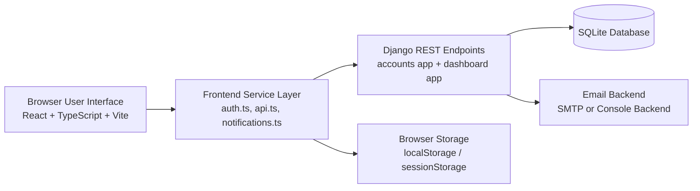
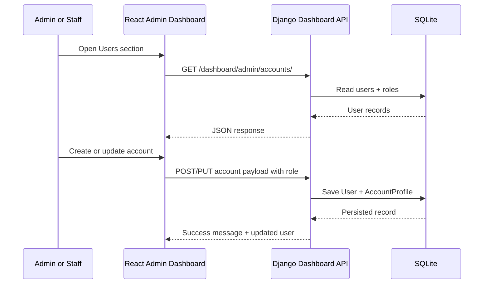
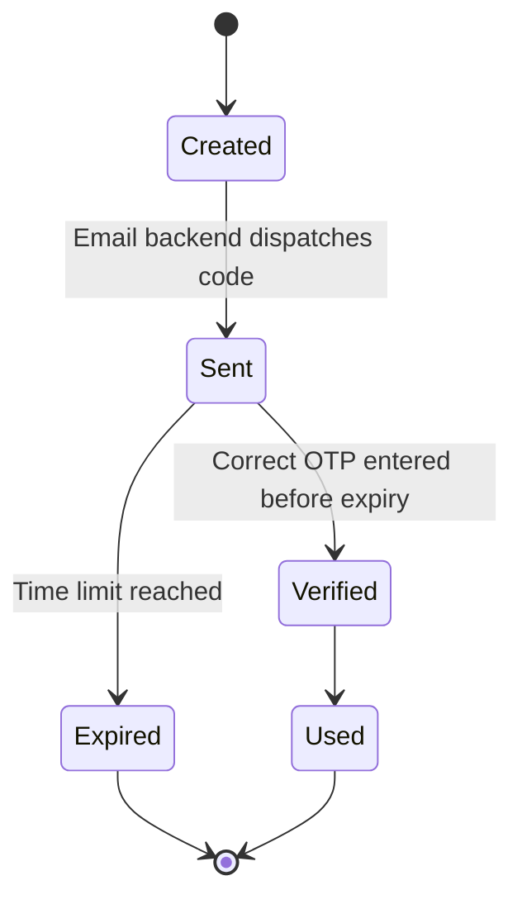
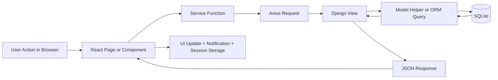

# DRMS – Disaster Risk Management System
## Complete System Documentation

> **Project**: Lucena City DRRMO Disaster Risk Management System  
> **Stack**: Django 6 (backend) + React 18 + TypeScript (frontend)  
> **Database**: SQLite (development)

---

## Table of Contents

1. [What the System Does](#1-what-the-system-does)
2. [Project Folder Structure](#2-project-folder-structure)
3. [Tech Stack & Dependencies](#3-tech-stack--dependencies)
4. [Backend (Django)](#4-backend-django)
   - [Settings & Configuration](#41-settings--configuration)
   - [URL Routing](#42-url-routing)
   - [Accounts App](#43-accounts-app)
   - [Dashboard App](#44-dashboard-app)
5. [Frontend (React + TypeScript)](#5-frontend-react--typescript)
   - [App Entry Point & Bootstrap](#51-app-entry-point--bootstrap)
   - [Routing](#52-routing)
   - [Services Layer](#53-services-layer)
   - [Pages](#54-pages)
   - [Components](#55-components)
   - [Data Files](#56-data-files)
   - [Types](#57-types)
6. [Authentication System](#6-authentication-system)
   - [Citizen Registration Flow](#61-citizen-registration-flow)
       - [Unified Login & Role Routing](#62-unified-login--role-routing)
       - [Forgot Password Flow](#63-forgot-password-flow)
       - [Session Storage Strategy](#64-session-storage-strategy)
7. [Admin Dashboard](#7-admin-dashboard)
8. [API Reference](#8-api-reference)
9. [Database Models](#9-database-models)
10. [How to Run the Project](#10-how-to-run-the-project)
11. [Key Concepts Explained Simply](#11-key-concepts-explained-simply)
12. [Additional System Diagrams](#12-additional-system-diagrams)
13. [Contributors](#13-contributors)

---

## 1. What the System Does

This is a **web application for Lucena City's Disaster Risk Reduction and Management Office (DRRMO)**. It has two main audiences:

### For Citizens (Regular Users)
- Create an account and log in securely using **email + OTP verification**
- View an interactive **disaster map** showing incidents in the area
- Take **simulation/training courses** to learn disaster preparedness
- Manage their **profile** (personal info, emergency contacts, etc.)
- Reset their password using **email OTP verification**

### For Admins and Staff (DRRMO Personnel)
- Use the same **unified login page** as citizens (`/login`)
- Be routed automatically to the **admin dashboard** based on account role
- Bypass login OTP when the account role is `admin` or `staff`
- Access an **admin dashboard** with multiple management sections:
  - **Overview** – live statistics (total users, active users, pending OTPs)
  - **Users** – create, edit, deactivate, and delete citizen/admin accounts
  - **Map** – plot and manage incident/hazard locations on a map
  - **Reports** – view and filter hazard reports
  - **Resources** – track evacuation resources and maintenance
  - **Simulation** – create and manage training courses with video lessons
  - **Settings** – profile settings

---

## 2. Project Folder Structure

```
Capstone-Project/
│
├── backend/                        ← Django project
│   ├── manage.py                   ← Django CLI entry point
│   ├── db.sqlite3                  ← SQLite database file
│   ├── requirements.txt            ← Python dependencies
│   │
│   ├── config/                     ← Django project settings
│   │   ├── settings.py             ← Main configuration (DB, email, CORS, etc.)
│   │   ├── urls.py                 ← Root URL dispatcher
│   │   ├── wsgi.py                 ← Production server entry point
│   │   └── asgi.py                 ← Async server entry point
│   │
│   ├── accounts/                   ← User authentication app
│   │   ├── models.py               ← OneTimePassword + AccountProfile models
│   │   ├── views.py                ← Register/login/password-reset endpoints
│   │   ├── urls.py                 ← URL patterns for accounts
│   │   ├── admin.py                ← Django admin configuration
│   │   └── migrations/             ← Database migration files
│   │
│   └── dashboard/                  ← Admin dashboard app
│       ├── models.py               ← (empty – uses Django's User model)
│       ├── views.py                ← Admin CRUD endpoints
│       └── urls.py                 ← URL patterns for dashboard
│
├── frontend/                       ← React + TypeScript project
│   ├── index.html                  ← HTML shell
│   ├── vite.config.ts              ← Vite build configuration
│   ├── tailwind.config.js          ← Tailwind CSS configuration
│   ├── package.json                ← Node.js dependencies
│   │
│   └── src/
│       ├── main.tsx                ← App entry point (renders <App>)
│       ├── index.css               ← Global styles (Tailwind base)
│       │
│       ├── routes/
│       │   ├── AppRouter.tsx       ← All page routes defined here
│       │   └── ProtectedRoute.tsx  ← Route guard (redirects if not logged in)
│       │
│       ├── services/
│       │   ├── api.ts              ← All HTTP calls to Django backend
│       │   ├── auth.ts             ← Auth state + login/register/logout logic
│       │   ├── notifications.ts    ← In-app notification management
│       │   └── simulationCourses.ts← Course data management (localStorage)
│       │
│       ├── types/
│       │   └── api.ts              ← TypeScript interfaces for API data
│       │
│       ├── pages/
│       │   ├── landing/            ← Public home page
│       │   ├── auth/
│       │   │   ├── login/          ← Unified login + forgot-password page
│       │   │   ├── register/       ← Citizen registration page
│       │   │   └── admin/          ← Legacy admin redirect + account creation pages
│       │   ├── admin-dashboard/    ← Admin control center
│       │   │   └── sections/       ← Individual dashboard tab sections
│       │   ├── disaster-map/       ← Interactive hazard map
│       │   ├── simulation/         ← Training courses viewer
│       │   ├── profile/            ← User profile settings
│       │   ├── admin-reports/      ← Admin reports page
│       │   ├── admin-simulation/   ← Admin simulation management page
│       │   └── admin-shared/       ← Shared placeholder page
│       │
│       ├── components/
│       │   ├── NavigationBar.tsx           ← Top nav (notifications, user menu)
│       │   ├── AdminSidebar.tsx            ← Admin dashboard side navigation
│       │   ├── AdminIncidentMapPanel.tsx   ← Map for adding incidents
│       │   └── AdminSimulationManager.tsx  ← Course editor (add/edit/delete)
│       │
│       ├── data/
│       │   ├── adminNavigation.ts  ← Menu items for admin sidebar
│       │   └── adminOperations.ts  ← Mock data for incidents & simulations
│       │
│       └── images/                 ← Static image assets
│
└── docs/                           ← Project documentation
```

---

## 3. Tech Stack & Dependencies

### Backend (`backend/requirements.txt`)

| Package | Version | Purpose |
|---|---|---|
| **Django** | 6.0.3 | Web framework – handles routing, ORM, admin, auth |
| **djangorestframework** | 3.16.1 | Adds REST API support (JSON responses, decorators, status codes) |
| **django-cors-headers** | 4.9.0 | Allows the React app (port 5173) to call the Django API (port 8000) |

### Frontend (`frontend/package.json`)

| Package | Purpose |
|---|---|
| **React 18** | UI library |
| **TypeScript** | Type-safe JavaScript |
| **Vite** | Fast build tool and dev server |
| **React Router DOM** | Client-side page navigation |
| **Axios** | HTTP client for API calls |
| **Tailwind CSS** | Utility-first CSS framework for styling |
| **Leaflet / react-leaflet** | Interactive maps |
| **Recharts** | Charts and graphs in the dashboard |
| **Lucide React** | Icon library |

---

## 4. Backend (Django)

### 4.1 Settings & Configuration

**File**: `backend/config/settings.py`

Key settings:

```
SECRET_KEY     → Django security key (must be changed in production!)
DEBUG = True   → Development mode (shows detailed error pages)
DATABASES      → SQLite file: backend/db.sqlite3
```

**CORS** (Cross-Origin Resource Sharing) is configured so the React frontend can communicate with Django:
```python
CORS_ALLOWED_ORIGINS = ['http://localhost:5173', 'http://127.0.0.1:5173']
CORS_ALLOW_CREDENTIALS = True  # Required for session cookies
```

**Email settings** are loaded from a `.env` file in the `backend/` folder. If no SMTP credentials are provided, emails go to the console (for development). Settings include:
- `EMAIL_HOST`, `EMAIL_PORT`, `EMAIL_USE_TLS` – SMTP server details
- `OTP_EMAIL_SUBJECT` – Subject line of OTP emails
- `OTP_EMAIL_BODY_TEMPLATE` – Body of OTP emails (supports `{otp_code}`, `{expiry_minutes}`, `{action_label}`)

### 4.2 URL Routing

**File**: `backend/config/urls.py`

Django routes incoming requests to one of two apps:

```
/accounts/...   → handled by accounts/urls.py
/dashboard/...  → handled by dashboard/urls.py
/admin/         → Django built-in admin panel
```

### 4.3 Accounts App

**Purpose**: Handles registration, unified login, role-aware access, and password reset using OTP (One-Time Password) email verification.

#### Model: `OneTimePassword` (`accounts/models.py`)

Stores every OTP request that is generated:

| Field | Type | Description |
|---|---|---|
| `email` | EmailField | Who the OTP was sent to |
| `purpose` | CharField | `'register'`, `'login'`, or `'password_reset'` |
| `code_hash` | CharField | Hashed OTP (never stored as plain text) |
| `payload` | JSONField | Extra data (e.g., registration info, userId) |
| `expires_at` | DateTimeField | When OTP expires (3 minutes after creation) |
| `is_used` | BooleanField | Whether the OTP has already been used |
| `created_at` | DateTimeField | When the OTP was created |

#### Model: `AccountProfile` (`accounts/models.py`)

Stores the application's canonical account role separate from Django's built-in flags.

| Field | Type | Description |
|---|---|---|
| `user` | OneToOneField(User) | Connects one profile to one Django user |
| `role` | CharField | `'admin'`, `'staff'`, or `'citizen'` |
| `created_at` | DateTimeField | Profile creation timestamp |
| `updated_at` | DateTimeField | Last profile update timestamp |

Role rules:
- `admin` and `staff` have dashboard access
- `citizen` uses the public side of the application
- The role in `AccountProfile` is the primary source of truth for routing and UI permissions

#### Views & Endpoints (`accounts/views.py`)

**Important helper functions:**

| Function | What it does |
|---|---|
| `_coerce_bool(value)` | Converts any value (string "false", integer 0) to a proper Python bool |
| `_generate_otp_code()` | Returns a random 6-digit number as string |
| `_send_otp_email(email, code, purpose)` | Sends OTP via configured email backend |
| `_create_otp(email, purpose, payload)` | Creates and stores a hashed OTP record |
| `_get_valid_otp(email, purpose)` | Finds the most recent non-expired, non-used OTP |
| `_get_recent_otp_request(email, purpose)` | Checks if an OTP was requested within the last 3 minutes (rate limiting) |
| `_has_recent_verified_login_otp(email, user_id)` | Checks if user verified a login OTP in the past 5 minutes (bypass window) |
| `_serialize_user(user)` | Converts a Django User to a safe JSON dict |
| `get_user_role(user)` | Returns the normalized account role (`admin`, `staff`, or `citizen`) |
| `user_has_dashboard_access(user)` | Returns true when the role can access dashboard routes |
| `user_bypasses_login_otp(user)` | Returns true for `admin` and `staff` login attempts |

**Endpoint functions:**

| Function/Endpoint | HTTP | URL | Purpose |
|---|---|---|---|
| `test_connection` | GET | `/accounts/test/` | Health check – confirms backend is running |
| `register_user` | POST | `/accounts/auth/register/` | Step 1 of registration – validates input and sends OTP |
| `verify_register_otp` | POST | `/accounts/auth/register/verify-otp/` | Step 2 of registration – verifies OTP and creates user account |
| `login_user` | POST | `/accounts/auth/login/` | Unified login – validates credentials and either sends OTP or bypasses it based on role |
| `verify_login_otp` | POST | `/accounts/auth/login/verify-otp/` | Step 2 of login – verifies OTP and establishes Django session |
| `request_password_reset` | POST | `/accounts/auth/password-reset/` | Sends a password reset OTP to the registered email |
| `confirm_password_reset` | POST | `/accounts/auth/password-reset/confirm/` | Verifies reset OTP and updates the password |

**Security measures in accounts:**
- Passwords are **hashed** before storage using Django's `make_password()` / `check_password()`
- OTP codes are **hashed** (not stored in plain text)
- OTPs **expire after 3 minutes**
- A **180-second cooldown** prevents OTP spam (rate limiting)
- A **5-minute bypass window** avoids re-sending OTP if user already verified recently
- `admin` and `staff` accounts bypass login OTP but still require valid credentials
- Password reset requires both a valid email and an unexpired OTP before password changes are accepted

### 4.4 Dashboard App

**Purpose**: Admin-only operations for managing user accounts and viewing statistics.

#### Views & Endpoints (`dashboard/views.py`)

All endpoints require **IsAdminUser** or **IsAuthenticated** permission (Django session-based auth).

| Endpoint | HTTP | URL | Permission | Purpose |
|---|---|---|---|---|
| `admin_dashboard_summary` | GET | `/dashboard/admin/summary/` | IsAuthenticated | Returns counts: total users, admin users, active last 30 days, pending OTPs, OTPs verified today |
| `list_dashboard_accounts` | GET | `/dashboard/admin/accounts/` | IsAdminUser | Returns all user accounts |
| `create_dashboard_account` | POST | `/dashboard/admin/accounts/create/` | IsAdminUser | Creates a new user or admin account |
| `dashboard_account_detail` | PUT/PATCH | `/dashboard/admin/accounts/<id>/` | IsAdminUser | Update a user account |
| `dashboard_account_detail` | DELETE | `/dashboard/admin/accounts/<id>/` | IsAdminUser | Delete a user account |

**Safety checks in dashboard:**
- Cannot delete your own currently logged-in account
- Cannot remove your own admin privileges
- Username uniqueness is enforced automatically (appends numbers if needed)

---

## 5. Frontend (React + TypeScript)

### 5.1 App Entry Point & Bootstrap

**File**: `frontend/src/main.tsx`

The app starts here. It:
1. Checks if the Django backend is reachable (calls `/accounts/test/`)
2. Shows a loading screen while checking
3. Shows a warning if the backend is not running
4. Renders the React app inside a `<BrowserRouter>` for routing

### 5.2 Routing

**File**: `frontend/src/routes/AppRouter.tsx`

Defines all pages and their URLs:

| Path | Page | Access |
|---|---|---|
| `/` | `LandingPage` | Public |
| `/login` | `LoginPage` | Public |
| `/register` | `RegisterPage` | Public |
| `/admin-page` | Redirect to `/login` | Public legacy route |
| `/admin-dashboard` | `AdminDashboardPage` | **Protected** (must be logged in and have dashboard access) |
| `/disaster-map` | `DisasterMapPage` | Public |
| `/simulation` | `SimulationPage` | Public |
| `/profile-settings` | `ProfileSettingsPage` | **Protected** |
| `/*` | Redirect to `/` | – |

**`ProtectedRoute` component** (`frontend/src/routes/ProtectedRoute.tsx`):
- Checks `isAuthenticated()` from `auth.ts`
- If not authenticated → redirects to the specified `redirectTo` path
- If `requireDashboardAccess` is enabled and the session role is not `admin` or `staff` → redirects away from dashboard routes
- If authenticated → renders the requested page

Several admin sub-routes (e.g., `/admin-reports`, `/admin-simulation`) redirect to `/admin-dashboard?section=...` with a query parameter so the dashboard shows the correct tab.

### 5.3 Services Layer

These files contain all the **business logic** that connects to the backend.

#### `api.ts` – Raw HTTP calls

Uses **Axios** to make HTTP requests. Auto-detects the backend URL:
- Default: `http://localhost:8000` or `http://127.0.0.1:8000`
- Can be overridden with `VITE_API_BASE_URL` environment variable

All API functions match to a Django endpoint:

```typescript
getTestMessage()                    → GET  /accounts/test/
registerAccount(payload)            → POST /accounts/auth/register/
verifyRegisterOtp(payload)          → POST /accounts/auth/register/verify-otp/
loginAccount(payload)               → POST /accounts/auth/login/
verifyLoginOtp(payload)             → POST /accounts/auth/login/verify-otp/
requestPasswordReset(payload)      → POST /accounts/auth/password-reset/
confirmPasswordReset(payload)      → POST /accounts/auth/password-reset/confirm/
getAdminDashboardSummary()          → GET  /dashboard/admin/summary/
createDashboardAccount(payload)     → POST /dashboard/admin/accounts/create/
getDashboardAccounts()              → GET  /dashboard/admin/accounts/
updateDashboardAccount(id, payload) → PUT  /dashboard/admin/accounts/<id>/
deleteDashboardAccount(id)          → DELETE /dashboard/admin/accounts/<id>/
```

`withCredentials: true` ensures session cookies are sent with every request (required for Django session auth).

#### `auth.ts` – Authentication state management

The brain of the frontend auth system. Key responsibilities:

**Storing login state:**
- Uses `localStorage` or `sessionStorage` depending on "Keep me logged in"
- Auth key: `drms-auth = 'true'`
- User profile key: `drms-session-user` (JSON with fullName, email, optional fields)

**Key exported functions:**

| Function | Purpose |
|---|---|
| `requestRegisterOtp(payload)` | Calls `registerAccount()`, handles errors |
| `verifyRegisterOtpCode(email, otp)` | Calls `verifyRegisterOtp()`, handles errors |
| `requestLoginOtp(email, password, keepLoggedIn, forceOtp)` | Calls `loginAccount()`, handles role-based OTP bypass |
| `verifyLoginOtpCode(payload)` | Calls `verifyLoginOtp()`, saves session on success |
| `requestPasswordResetOtp(email)` | Requests a password reset OTP |
| `confirmPasswordResetWithOtp(payload)` | Confirms OTP and updates password |
| `isAuthenticated()` | Returns true if auth key exists in either storage |
| `getCurrentUserProfile()` | Returns the stored user profile object |
| `hasDashboardAccess()` | Returns true if current role can open dashboard pages |
| `getCurrentUserDisplayName()` | Returns first name of logged-in user |
| `updateCurrentUserProfile(fullName)` | Updates display name in session storage |
| `updateCurrentUserAvatar(photoUrl)` | Updates profile photo URL in session storage |
| `updateCurrentUserPersonalInfo(payload)` | Saves phone, address, emergency contacts, etc. |
| `logoutUser()` | Clears all auth state from both storages |

**Auth event system**: Dispatches `drms-auth-changed` browser event after any auth state change so components can re-render reactively.

#### `notifications.ts` – In-app notifications

A simple notification system stored in `localStorage` under `drms-notifications`.

- Maximum 25 notifications stored at a time
- Each notification has: `id`, `message`, `createdAt`, `read` (boolean)
- `addNotification(message)` – called throughout the app after actions
- `markAllNotificationsRead()` – marks all as read
- Dispatches `drms-notifications-changed` event when updated

#### `simulationCourses.ts` – Training course management

Manages training/simulation courses entirely in the browser (`localStorage` under `drms-simulation-courses`).

- Courses have: title, description, difficulty, lessons, and learning materials
- Each lesson can have: title, duration, video URL or uploaded file, description
- Default sample courses are pre-loaded (Earthquake Response, Fire Emergency)
- Used by both the citizen `SimulationPage` and the admin `SimulationSection`/`AdminSimulationManager`

### 5.4 Pages

#### Landing Page (`/`)
**File**: `pages/landing/LandingPage.tsx`

The public home page. Contains:
- Hero section with call-to-action buttons
- Embedded interactive disaster map preview
- Preparedness tips and guides
- Recent incident alerts display
- Navigation links to login, register, simulation, map

#### Login Page (`/login`)
**File**: `pages/auth/login/LoginPage.tsx`

Unified login for all account types:
1. Enter email/username + password
2. Backend checks the account role
3. `citizen` accounts receive a 6-digit login OTP
4. `admin` and `staff` accounts bypass login OTP and are redirected to dashboard routes automatically

Features:
- Cooldown timer shows how long until user can request another OTP
- "Keep me logged in" checkbox controls localStorage vs sessionStorage
- Forgot-password modal supports reset OTP requests, resend cooldown, and new password submission
- Redirects to `/landing` or `/admin-dashboard` automatically based on the current session role

#### Register Page (`/register`)
**File**: `pages/auth/register/RegisterPage.tsx`

Three-step registration:
1. Fill out form (full name, email, username, password)
2. OTP sent to email
3. Enter OTP → account created, redirect to login

#### Admin Login Page (`/admin-page`)
**File**: `pages/auth/admin/AdminLoginPage.tsx`

Legacy compatibility route only:
- Immediately redirects to `/login`
- Preserved so older links or bookmarks do not break after the unified login change

#### Admin Create Account Page
**File**: `pages/auth/admin/AdminCreateAccountPage.tsx`

Admin-accessible form to create new admin or citizen accounts directly.

#### Admin Dashboard Page (`/admin-dashboard`)
**File**: `pages/admin-dashboard/AdminDashboardPage.tsx`

The main admin control center. Reads the `?section=` URL query parameter to determine which section/tab to display. Contains:
- Left sidebar (`AdminSidebar`)
- Main content area that renders one of the 7 section components

#### Disaster Map Page (`/disaster-map`)
**File**: `pages/disaster-map/DisasterMapPage.tsx`

Interactive map using **Leaflet** showing:
- Hazard/incident markers on the map
- Filter controls
- Clickable markers showing incident details

#### Simulation Page (`/simulation`)
**File**: `pages/simulation/SimulationPage.tsx`

Training course browser for citizens:
- Lists available courses with difficulty badges
- Opens a course to view lessons (video player, learning materials)
- Progress tracking

#### Profile Settings Page (`/profile-settings`)
**File**: `pages/profile/ProfileSettingsPage.tsx`

Protected page for logged-in users to update:
- Display name and profile photo
- Phone number, birth date, gender
- Home address (line 1, barangay, city, province, postal code)
- Emergency contact name and number

All changes are saved locally via `auth.ts` update functions.

#### Admin Reports Page
**File**: `pages/admin-reports/AdminReportsPage.tsx`

Filterable view of hazard reports. (Also accessible via `?section=reports` in admin dashboard.)

#### Admin Simulation Management Page
**File**: `pages/admin-simulation/AdminSimulationManagementPage.tsx`

Wraps the `AdminSimulationManager` component for managing courses from the admin side.

### 5.5 Components

#### `NavigationBar.tsx`

Top navigation bar shown across all pages. Features:
- Logo and site name
- Navigation links (Home, Map, Simulation, etc.)
- **Notifications bell** with unread count badge
- Dropdown showing recent notifications with "Mark all read" option
- User menu (shows display name, link to profile, logout button)
- Responsive mobile hamburger menu
- Listens to `drms-auth-changed` and `drms-notifications-changed` events to update in real time

#### `AdminSidebar.tsx`

Left sidebar navigation for the admin dashboard. Features:
- Navigation items defined in `data/adminNavigation.ts`
- Highlights the currently active section
- Logout button at the bottom
- Collapses to icons on smaller screens

#### `AdminIncidentMapPanel.tsx`

Interactive Leaflet map used in the admin dashboard's Map section. Features:
- Click on map to add a new incident marker
- Form popup to enter incident type, description, severity
- Existing incidents shown as colored markers
- Marker colors indicate severity level

#### `AdminSimulationManager.tsx`

Full-featured course editor for admins. Features:
- Create new courses with title, description, difficulty (Beginner/Intermediate/Advanced)
- Add/edit/delete lessons within a course
- Upload video files or enter YouTube/embed URLs for lessons
- Add learning materials (PDF-like content blocks) to lessons
- Save everything to `localStorage` via `simulationCourses.ts`
- Preview mode

### 5.6 Data Files

#### `adminNavigation.ts`

Defines the sidebar menu items for the admin dashboard:

```typescript
[
  { label: 'Overview',    section: 'overview',    icon: LayoutDashboard },
  { label: 'Users',       section: 'users',       icon: Users },
  { label: 'Map',         section: 'map',         icon: Map },
  { label: 'Reports',     section: 'reports',     icon: FileText },
  { label: 'Resources',   section: 'resources',   icon: Package },
  { label: 'Simulation',  section: 'simulation',  icon: BookOpen },
  { label: 'Settings',    section: 'settings',    icon: Settings },
]
```

#### `adminOperations.ts`

Contains **static/mock data** used in the admin dashboard for:
- Sample incident/hazard types and their map icons
- Sample simulation course structures
- Severity levels and color mappings
- Report categories

### 5.7 Types

**File**: `frontend/src/types/api.ts`

TypeScript interfaces that describe the shape of all API request/response data:

| Interface | Used for |
|---|---|
| `TestApiResponse` | `GET /accounts/test/` response |
| `AuthApiResponse` | Login/register responses |
| `AuthUser` | User object in responses |
| `RegisterApiPayload` | Registration request body |
| `LoginApiPayload` | Login request body |
| `VerifyOtpPayload` | OTP verification request body |
| `AdminDashboardSummaryResponse` | Dashboard stats response |
| `DashboardCreateAccountPayload` | Create account request body |
| `DashboardCreateAccountResponse` | Create account response |
| `DashboardAccountsResponse` | List accounts response |
| `DashboardUpdateAccountPayload` | Update account request body |
| `DashboardUpdateAccountResponse` | Update account response |
| `DashboardDeleteAccountResponse` | Delete account response |

---

## 6. Authentication System

### 6.1 Citizen Registration Flow

```
User fills form → POST /accounts/auth/register/
                  ↓
           Backend validates:
           - All fields present
           - Valid email format
           - Password ≥ 6 characters
           - Email not already registered
           - No OTP requested in last 180 seconds
                  ↓
           Creates OTP record in DB:
           - Hashes OTP code (never stored plain)
           - Stores payload: { fullName, username, passwordHash }
           - Expires in 3 minutes
                  ↓
           Sends OTP email to user
                  ↓
User enters OTP → POST /accounts/auth/register/verify-otp/
                  ↓
           Backend validates:
           - OTP matches hash
           - OTP not expired
           - OTP not already used
           - Email still not registered
                  ↓
           Creates Django User account
           Marks OTP as used
                  ↓
           Returns success + user info
                  ↓
Frontend saves nothing yet (redirects to login)
```

### 6.2 Unified Login & Role Routing

```
User enters email + password → POST /accounts/auth/login/
                                ↓
                         Backend validates:
                         - Finds user by email OR username
                         - Verifies password
                         - User is active
                                ↓
                         Resolve role from AccountProfile:
                         - admin
                         - staff
                         - citizen
                                ↓
                         Is role admin/staff?
                         YES → bypass OTP, create session, return user
                         NO → continue citizen OTP flow
                                ↓
                         Check bypass: has user verified a login
                         OTP in the last 5 minutes?
                         YES → skip new OTP, create session, return user
                         NO → continue
                                ↓
                         Rate limit check: OTP requested < 180 sec ago?
                         YES → return 429 Too Many Requests + retryAfterSeconds
                                ↓
                         Create OTP, send email
                         Return { otpEmail: "..." }
                                ↓
User enters OTP → POST /accounts/auth/login/verify-otp/
                   ↓
            Backend validates OTP (hash match, not expired, not used)
            Marks OTP as used
            Calls Django's login() → creates server session
            Returns { user: { fullName, email, role, isAdmin, isStaff, hasDashboardAccess } }
                   ↓
Frontend saves to localStorage/sessionStorage:
- drms-auth = 'true'
- drms-session-user = { fullName, email, role, isAdmin, isStaff, hasDashboardAccess }
```

### 6.3 Forgot Password Flow

```
User enters registered email → POST /accounts/auth/password-reset/
                               ↓
                        Backend validates:
                        - Email is present and valid
                        - A matching account exists
                        - No password reset OTP was requested in the last 180 seconds
                               ↓
                        Create password-reset OTP
                        Send OTP email
                        Return { message, otpEmail }
                               ↓
User enters OTP + new password → POST /accounts/auth/password-reset/confirm/
                                  ↓
                           Backend validates:
                           - OTP matches hash
                           - OTP not expired
                           - OTP not already used
                           - New password length is valid
                                  ↓
                           User password is updated
                           OTP is marked used
                           Return success message
                                  ↓
Frontend shows success state and user can log in with the new password
```

### 6.4 Session Storage Strategy

| Scenario | Storage used | Lifetime |
|---|---|---|
| "Keep me logged in" checked | `localStorage` | Until manual logout |
| "Keep me logged in" unchecked | `sessionStorage` | Until browser tab/window closes |

The auth service always checks `sessionStorage` first, then `localStorage`, to find the active session.

---

## 7. Admin Dashboard

The admin dashboard (`/admin-dashboard`) is a **single-page application within the app**. It uses the URL query parameter `?section=` to determine which panel to show. The sidebar updates the URL, and the page reads the URL to decide what to render.

### Sections

| Section | Query Param | Component | What it shows |
|---|---|---|---|
| Overview | `?section=overview` | `OverviewSection` | User stats, active sessions, OTP counts, charts |
| Users | `?section=users` | `UsersSection` | Full user list with edit/delete/add controls |
| Map | `?section=map` | `MapSection` | Interactive incident map (`AdminIncidentMapPanel`) |
| Reports | `?section=reports` | `ReportsSection` | Hazard reports with filters |
| Resources | `?section=resources` | `ResourcesSection` | Evacuation resource maintenance tracking |
| Simulation | `?section=simulation` | `SimulationSection` | Course management (uses `AdminSimulationManager`) |
| Settings | `?section=settings` | `InlineModuleSection` | Admin profile settings |

### Users Section (CRUD)

The Users section calls the dashboard API to:
1. **Load all users** → `GET /dashboard/admin/accounts/`
2. **Create a new user** → fills form → `POST /dashboard/admin/accounts/create/`
3. **Edit a user** → click edit → fill form → `PUT /dashboard/admin/accounts/<id>/`
4. **Delete a user** → confirm dialog → `DELETE /dashboard/admin/accounts/<id>/`

---

## 8. API Reference

### Base URL
```
http://localhost:8000 (development)
```

### Accounts Endpoints

#### `GET /accounts/test/`
Health check.  
**Response**: `{ "message": "Backend connected successfully" }`

#### `POST /accounts/auth/register/`
Sends registration OTP to email.  
**Request body**:
```json
{ "fullName": "Juan Dela Cruz", "email": "juan@example.com", "password": "secret123", "username": "juan" }
```
**Response (200)**: `{ "message": "OTP sent to your email..." }`  
**Response (400)**: `{ "error": "This email is already registered." }`  
**Response (429)**: `{ "error": "Please wait X seconds...", "retryAfterSeconds": 45 }`

#### `POST /accounts/auth/register/verify-otp/`
Verifies OTP and creates account.  
**Request body**: `{ "email": "juan@example.com", "otp": "123456" }`  
**Response (201)**: `{ "message": "Registration successful!", "user": { "fullName": "Juan Dela Cruz", "email": "..." } }`

#### `POST /accounts/auth/login/`
Unified login endpoint. Validates credentials and sends login OTP for citizens, while `admin` and `staff` roles bypass OTP.  
**Request body**:
```json
{ "email": "juan@example.com", "password": "secret123", "forceOtp": true }
```
**Response (200, OTP sent)**: `{ "message": "OTP sent...", "otpEmail": "juan@example.com" }`  
**Response (200, bypass)**: `{ "message": "Login successful.", "skipOtp": true, "user": { ... } }`  

#### `POST /accounts/auth/login/verify-otp/`
Verifies login OTP and establishes session.  
**Request body**: `{ "email": "juan@example.com", "otp": "123456" }`  
**Response (200)**: `{ "message": "Login successful.", "user": { "fullName": "...", "email": "...", "role": "citizen", "isAdmin": false, "isStaff": false, "hasDashboardAccess": false } }`

#### `POST /accounts/auth/password-reset/`
Requests a password reset OTP.  
**Request body**: `{ "email": "juan@example.com" }`  
**Response (200)**: `{ "message": "Password reset OTP sent to your email.", "otpEmail": "juan@example.com" }`  
**Response (404)**: `{ "error": "No account was found for that email address." }`

#### `POST /accounts/auth/password-reset/confirm/`
Verifies reset OTP and updates the password.  
**Request body**: `{ "email": "juan@example.com", "otp": "123456", "newPassword": "newsecret123" }`  
**Response (200)**: `{ "message": "Password reset successful. You can now log in with your new password." }`

### Dashboard Endpoints (Admin only)

All require an active admin session (set via Django session cookie).

#### `GET /dashboard/admin/summary/`
**Response**:
```json
{
  "summary": {
    "totalUsers": 25,
    "totalAdminUsers": 3,
    "activeUsersLast30Days": 12,
    "pendingOtps": 0,
    "verifiedOtpsToday": 5
  }
}
```

#### `GET /dashboard/admin/accounts/`
Returns all users.  
**Response**: `{ "users": [ { "id": 1, "fullName": "...", "email": "...", "role": "citizen", "isAdmin": false, "isStaff": false, ... } ] }`

#### `POST /dashboard/admin/accounts/create/`
Creates new account.  
**Request body**: `{ "fullName": "Jane", "email": "jane@example.com", "password": "pass123", "role": "staff" }`  
**Response (201)**: `{ "message": "Account created successfully.", "user": { ... } }`

#### `PUT /dashboard/admin/accounts/<user_id>/`
Updates existing account.  
**Request body**: `{ "fullName": "Jane Updated", "email": "jane@example.com", "username": "jane", "role": "admin", "isActive": true }`  
**Response (200)**: `{ "message": "Account updated successfully.", "user": { ... } }`

#### `DELETE /dashboard/admin/accounts/<user_id>/`
Deletes an account.  
**Response (200)**: `{ "message": "Account deleted successfully." }`

---

## 9. Database Models

### Django Built-in `User` model (used for all accounts)

| Field | Type | Description |
|---|---|---|
| `id` | Auto ID | Primary key |
| `username` | CharField | Unique username (auto-generated if not provided) |
| `email` | EmailField | User's email address |
| `first_name` | CharField | Used to store full name |
| `password` | CharField | Hashed password |
| `is_staff` | BooleanField | True = admin/DRRMO staff |
| `is_superuser` | BooleanField | True = full Django admin access |
| `is_active` | BooleanField | False = account disabled |
| `date_joined` | DateTimeField | Account creation timestamp |
| `last_login` | DateTimeField | Last successful login timestamp |

Notes:
- Django `User` remains the authentication model used for passwords and sessions
- `AccountProfile.role` is the app-level role used by the frontend and dashboard guards

### `OneTimePassword` model (`accounts` app)

| Field | Description |
|---|---|
| `email` | Who the OTP was sent to |
| `purpose` | `'register'`, `'login'`, or `'password_reset'` |
| `code_hash` | Hashed OTP code (bcrypt-style via Django) |
| `payload` | JSON blob (stores registration data or `userId` for login) |
| `expires_at` | Expiry timestamp (3 minutes from creation) |
| `is_used` | Prevents OTP reuse |
| `created_at` | Creation timestamp (used for rate limiting) |

### `AccountProfile` model (`accounts` app)

| Field | Description |
|---|---|
| `user` | One-to-one link to Django `User` |
| `role` | Canonical role: `admin`, `staff`, or `citizen` |
| `created_at` | Creation timestamp |
| `updated_at` | Last update timestamp |

This model was added so the app no longer depends only on `is_staff` / `is_superuser` to decide where a user should go after login.

---

## 10. How to Run the Project

### Backend Setup

```powershell
# Navigate to the backend folder
cd Capstone-Project/backend

# Activate the virtual environment
& "../.venv/Scripts/Activate.ps1"

# Install dependencies
pip install -r requirements.txt

# Run database migrations
python manage.py migrate

# Start the Django development server
python manage.py runserver
# → Running at http://127.0.0.1:8000/
```

**Optional – create an admin account:**
```powershell
python manage.py createsuperuser
```

**Optional – configure email (.env file):**
Create `backend/.env`:
```
EMAIL_HOST_USER=youremail@gmail.com
EMAIL_HOST_PASSWORD=your_app_password
```
Without this, OTP codes are printed to the console instead of emailed.

### Frontend Setup

```powershell
# Navigate to the frontend folder
cd Capstone-Project/frontend

# Install Node.js dependencies
npm install

# Start the Vite development server
npm run dev
# → Running at http://localhost:5173/
```

### Both must be running at the same time.

---

## 11. Key Concepts Explained Simply

### What is OTP?
OTP stands for **One-Time Password**. It's a 6-digit number that is:
- Generated randomly
- Sent to your email
- Valid for only 3 minutes
- Can only be used once

This is used during registration, citizen login, and password reset because it proves you actually own the email address you entered.

### What is AccountProfile?
`AccountProfile` is the role record attached to each Django user. It tells the app whether the user is an `admin`, `staff`, or `citizen`.

- `admin` and `staff` go to the dashboard side
- `citizen` goes to the public side
- The unified login page uses this role to decide whether OTP is required and where to redirect after login

### What is a Django Session?
When a user successfully logs in, Django creates a **session** – a record on the server that says "this browser/user is authenticated." It assigns a session ID stored as a browser cookie. On every future request, the browser sends that cookie, and Django knows who you are without you having to log in again.

### What is CORS?
**CORS (Cross-Origin Resource Sharing)** is a browser security rule that prevents websites from making requests to a different domain without permission. Since the React app runs on `localhost:5173` and Django runs on `localhost:8000`, they are considered "different origins." The `django-cors-headers` package tells Django to allow requests from the React app.

### What is REST API?
A **REST API** is a way for two programs to communicate using standard HTTP methods:
- `GET` – retrieve data
- `POST` – create / send data
- `PUT/PATCH` – update data
- `DELETE` – delete data

Data is exchanged in **JSON format** (a text-based data format).

### What is the difference between localStorage and sessionStorage?
Both are browser storage areas that save data as key-value pairs:
- **`localStorage`**: Data persists even after closing the browser. Used when "Keep me logged in" is checked.
- **`sessionStorage`**: Data is cleared when the browser tab/window closes. Used for temporary sessions.

### What is Leaflet?
**Leaflet** is a JavaScript library for displaying interactive maps. In this project it shows markers (pins) on a map of Lucena City to indicate where incidents or hazards are located. You can click on markers to see details.

### What is Tailwind CSS?
**Tailwind CSS** is a CSS framework where instead of writing custom CSS, you apply utility class names directly in HTML/JSX. For example: `class="text-red-500 font-bold p-4 rounded-lg"` makes text red, bold, with padding and rounded corners.

### Frontend vs Backend – What's the difference?
- **Frontend** (React): What you see in the browser. It downloads as JavaScript files to your device and runs in your browser. It handles UI, interactivity, and calls the backend for data.
- **Backend** (Django): Runs on a server. It handles the database, business logic, security, and email sending. It never runs in the user's browser.

---

## 12. Additional System Diagrams

These diagrams give a broader system view beyond the authentication-only flow.

### 12.1 High-Level Architecture



### 12.2 Unified Role-Based Access Flow

```mermaid
flowchart TD
       A[User signs in at /login] --> B[Django validates credentials]
       B --> C[Resolve AccountProfile role]
       C --> D{Role}
       D -- admin --> E[Dashboard session]
       D -- staff --> E
       D -- citizen --> F[Citizen session]
       E --> G[ProtectedRoute requireDashboardAccess]
       G --> H[/admin-dashboard]
       F --> I[/landing, /profile-settings, /simulation, /disaster-map]
```

### 12.3 Admin User Management Flow



### 12.4 OTP Lifecycle



### 12.5 Runtime Request Path



---

## 13. Contributors

The following contributor identities were found in the repository git history:

| Contributor | Git Identity | Notes |
|---|---|---|
| itsaymii | `aimeeballatan22@gmail.com` | Primary contributor name used in most commits |
| Aimee Rose | `120724621+itsaymii@users.noreply.github.com` | GitHub noreply identity also present in commit history |

Contributor summary from git history:
- `itsaymii <aimeeballatan22@gmail.com>`
- `Aimee Rose <120724621+itsaymii@users.noreply.github.com>`

If you want one canonical public contributor name in the docs, it would be better to standardize the local git config so future commits use a single identity.
