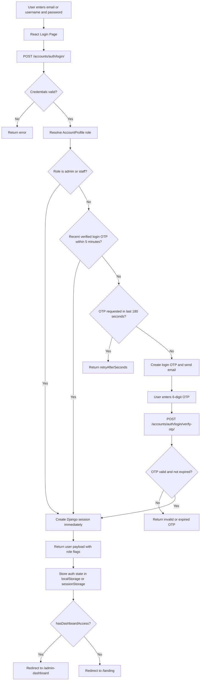
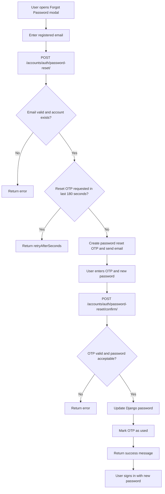

# Authentication Flow

This diagram reflects the current authentication behavior: unified login for all roles, OTP for citizens, OTP bypass for staff/admin, and OTP-based password reset.

## Unified Login

## Password Reset

