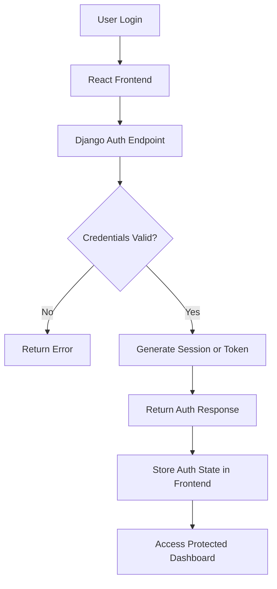

# Authentication Flow

This diagram shows the login and token/session process.

```mermaid
flowchart TD
	A[User Login] --> B[React Frontend]
	B --> C[Django Auth Endpoint]
	C --> D{Credentials Valid?}
	D -- No --> E[Return Error]
	D -- Yes --> F[Generate Session or Token]
	F --> G[Return Auth Response]
	G --> H[Store Auth State in Frontend]
	H --> I[Access Protected Dashboard]
```
