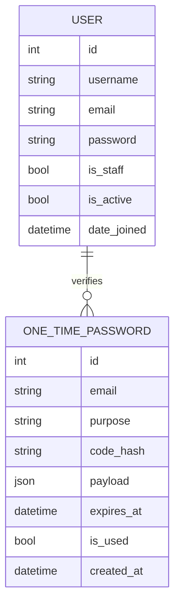

# Database ERD

This diagram documents the current authentication-related data model.

```mermaid
erDiagram
    USER {
        int id
        string username
        string email
        string password
        bool is_staff
        bool is_active
        datetime date_joined
    }

    ONE_TIME_PASSWORD {
        int id
        string email
        string purpose
        string code_hash
        json payload
        datetime expires_at
        bool is_used
        datetime created_at
    }

    USER ||--o{ ONE_TIME_PASSWORD : verifies
```

