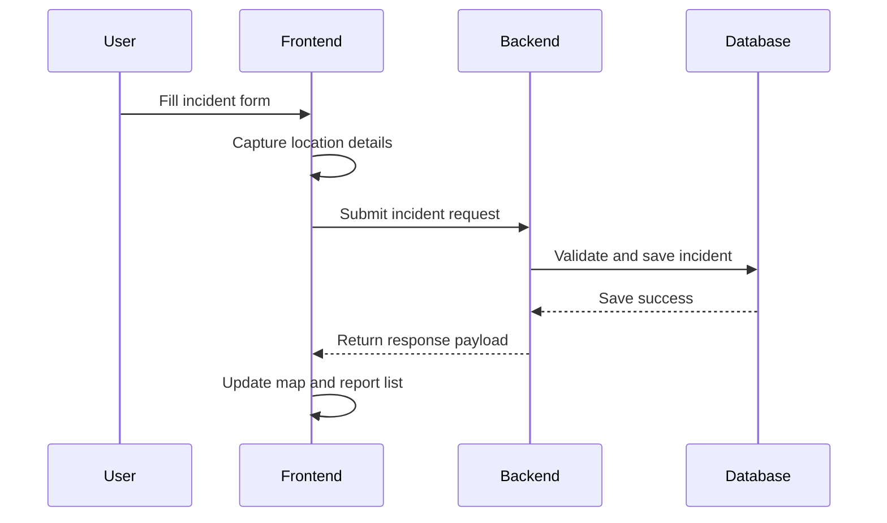

# Incident Reporting Flow

This sequence diagram shows how an incident is submitted and displayed.

```mermaid
sequenceDiagram
	participant User
	participant Frontend
	participant Backend
	participant Database

	User->>Frontend: Fill incident form
	Frontend->>Frontend: Capture location details
	Frontend->>Backend: Submit incident request
	Backend->>Database: Validate and save incident
	Database-->>Backend: Save success
	Backend-->>Frontend: Return response payload
	Frontend->>Frontend: Update map and report list
```
